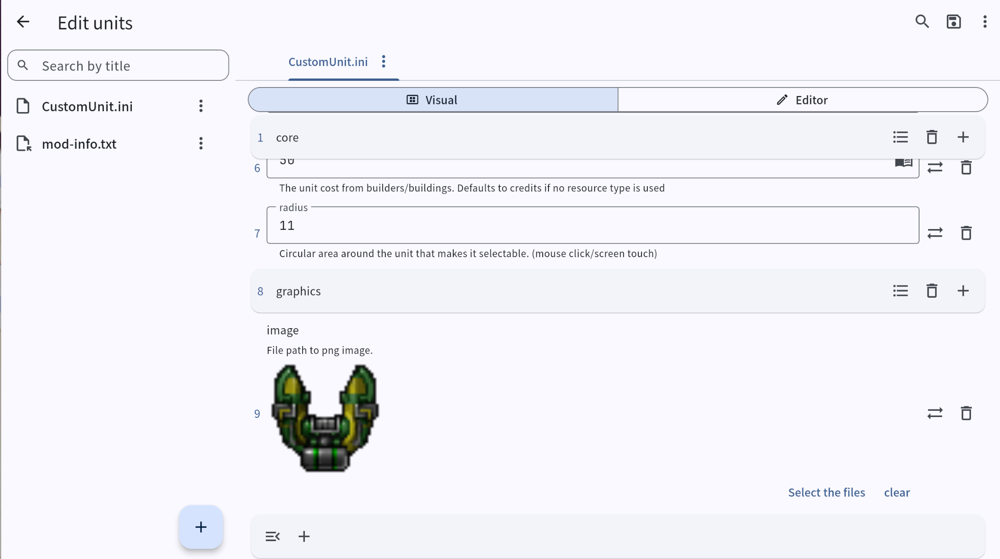

# Rust Assistant Rebuild

🎮 A Powerful Visual Mod Editor for Rusted Warfare  
Easily create, edit, and manage mods with an intuitive interface.  


We welcome contributions! 🌟  
- Translate UI or internal tables  
- Report issues or request features  
- Submit pull requests

---

### Features

### 🌍 Cross-platform operation and Steam Workshop

- Runs on Windows / Android / Linux.

- Supports reading and editing mods from the Steam Workshop.

### 📝 Support multi-line text
- Compatibility fixes for text formats starting with triple quotes (""").
- Proper handling of multi-line text and multi-line comments.

### 🗂 Safe File Names

- Automatically converts non-English file names into safe formats.
- Ensures compatibility across multiple platforms and avoids encoding issues.
---
### Screenshots



---


### 🌐 Localization

- To localize user-facing UI text, edit or create the corresponding **.arb** files and then run:

```
flutter gen-l10n
```

- To localize **internal code tables**, update the JSON files located in:

```
assets/code_data/
```

- **Current language support**:

  Simplified Chinese: ✅ 100%  
  English: ⚠️ 100% (machine translated, needs polishing by native speakers)  

- Contributions are welcome! Feel free to translate this project into other languages and submit your changes.

---


### Android build

Reference the key store from the app

Create a file named [project]/android/key.properties, which contains the definition of the key store location. Please remove the < > parentheses when replacing the content:

```
storePassword=<password-from-previous-step>
keyPassword=<password-from-previous-step>
keyAlias=upload
storeFile=<keystore-file-location>
```

The storeFile key path on macOS is similar to /Users/<user name>/upload-keystore.jks On Windows, it is similar to C:\\Users\\<user name>\\upload-keystore.jks.

> The Windows path of keystore.jks must use double backslashes: \\.
